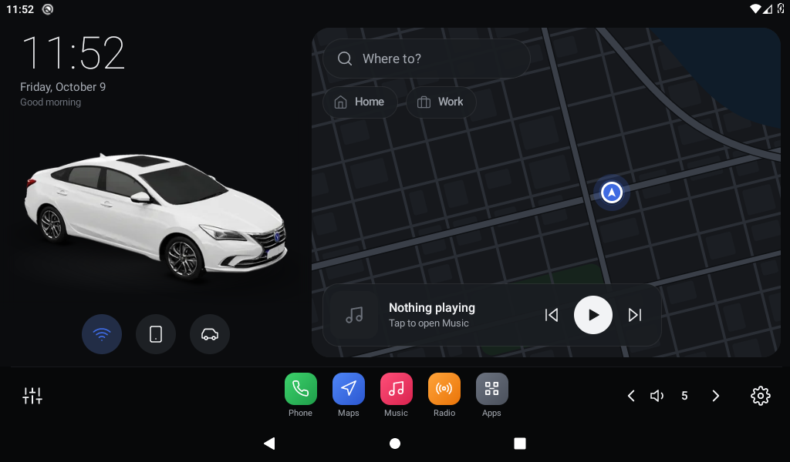
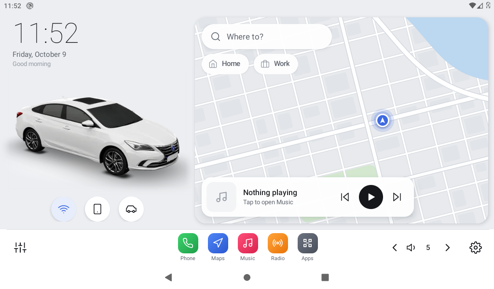
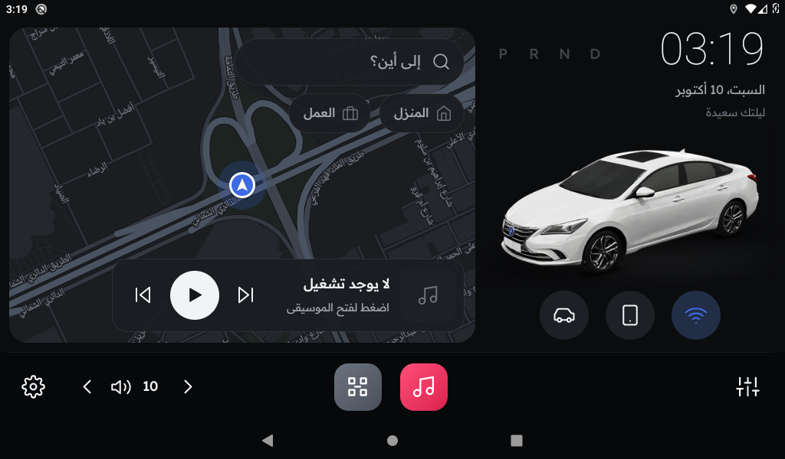
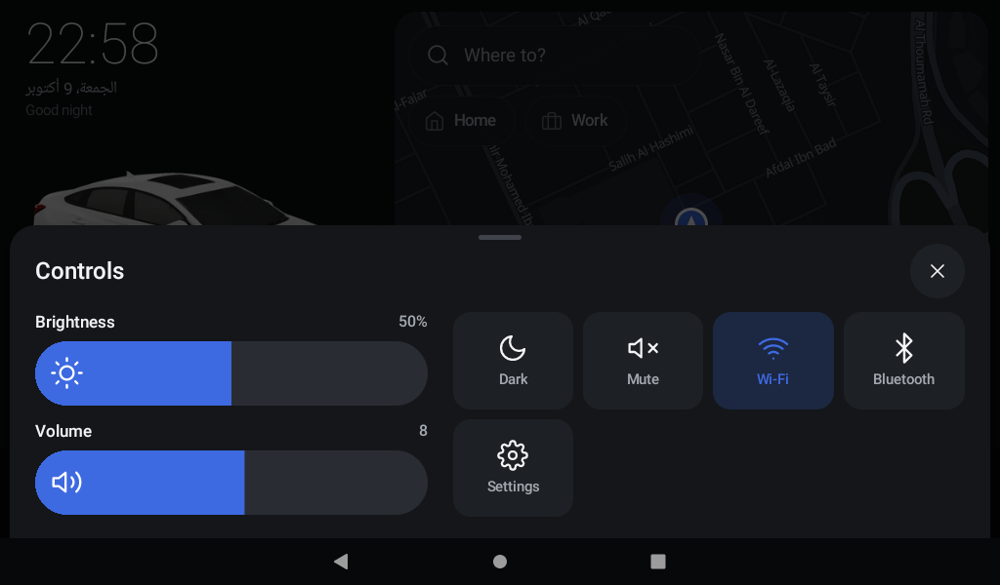
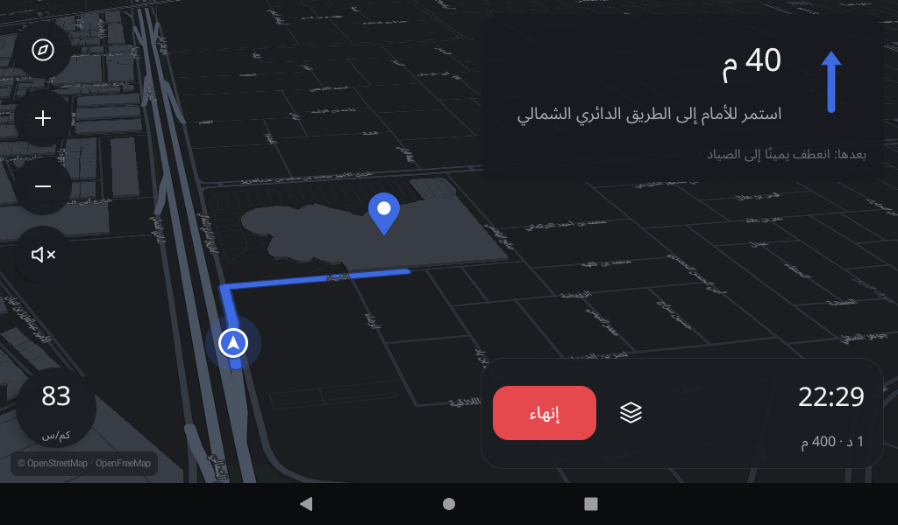
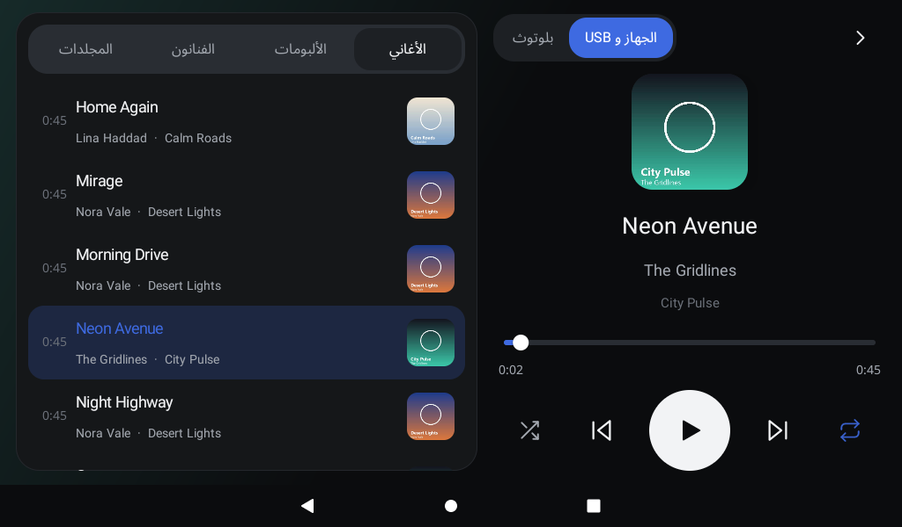

# Aura — modern EV-style system for the K2501 car head unit

An EV-inspired home screen with **the owner's own car in 3D**, **built-in maps with turn-by-turn navigation**, a **music
player** that also shows and controls **Bluetooth music from the phone**, light / dark / automatic themes, app drawer,
settings, a boot animation and an **in-app updater that pulls releases from GitHub**, packaged as a minimal ROM patch for the
**K2501** head unit (NWD firmware, Allwinner T507, Android 10, 1024×600). Arabic-first docs: [README.ar.md](README.ar.md).




| | |
|---|---|
|  |  |
|  |  |

* `app/` — the Aura launcher (Kotlin; the only library is [MapLibre Native](https://github.com/maplibre/maplibre-native)
  for the map). The car is a pre-rendered turntable (90 frames) that you can turn with a finger; see
  [docs/DEV.md](docs/DEV.md) for how it is made (`tools/car3d`).
* Aura Maps: search, route preview, turn-by-turn guidance with Arabic/English voice prompts and rerouting, on free
  OpenStreetMap services (OpenFreeMap tiles, Photon search, OSRM routing — internet needed). Aura Music: the unit's storage
  and USB sticks, plus the phone's Bluetooth music through the firmware's own Bluetooth module (covers looked up online by
  title and artist). The volume controls drive the unit's real (MCU) volume. ZLink (CarPlay) stays off until it is opened,
  and the Wi-Fi is kept out of power saving and reconnected when it loses its internet.
* `rom/` — the ROM tooling: overlay files, boot script, workshop that builds the image inside an Android emulator,
  block-patch generator, and the installers (`rom/flash`): **`install-linux.sh` / `aura-install.py` for Ubuntu/Linux**
  (finds the unit on the network by itself, needs only Python 3) and `aura-rom.ps1` + `.bat` files for Windows.
* Releases contain `aura-<ver>.apk` (used by the in-app updater) and `aura-rom-<ver>.zip` (the installer pack, Linux and Windows).

### Installing from an Ubuntu laptop

```
unzip aura-rom-1.2.0.zip -d aura && cd aura
# laptop and unit on the same network, e.g. the laptop's own Wi-Fi hotspot
./install-linux.sh            # finds the K2501, shows its state, asks for YES, installs, restarts, checks
./install-linux.sh status     # only look
./install-linux.sh restore    # put the stock firmware back
```

It only ever touches a unit that reports itself as a K2501, writes nothing unless the system partition is exactly the stock
image (or an interrupted run of this patch), writes in a crash-consistent order, and verifies the result. A unit that already
runs an older pack is updated from the screen (*Settings → Software update*); to move it to a newer *pack*, run `restore`
with the old pack first. Not tested on a real unit yet: see the notes in [README.ar.md](README.ar.md) and [docs/DEV.md](docs/DEV.md).

Aura is an independent design inspired by modern EV interfaces; it is not affiliated with any car maker.
See [NOTICE](NOTICE) for third-party notices.
